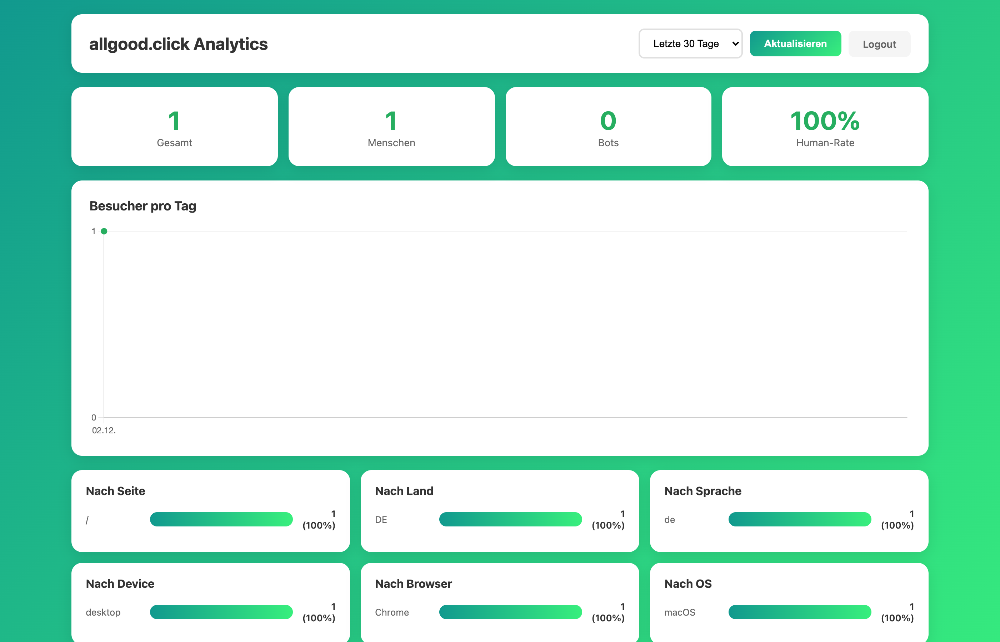

# SaaS Starter Stack

A production-ready SaaS starter with Stripe payments, automatic invoicing, multi-language support, and GDPR-compliant analytics. **No cookie banners needed.**


## Live Demo

**[allgood.click](https://allgood.click)** - See the full stack in action

---

## Features

### Payments
- **Stripe Checkout** - One-time payments and subscriptions
- **Mobile-optimized** - Automatic redirect vs. embedded checkout based on device
- **EU Tax Handling** - Tax-inclusive pricing with proper VAT
- **Webhook Processing** - Signature-verified payment events

### Invoicing
- **Zoho Invoice Integration** - Auto-generate invoices on successful payment
- **PDF Delivery** - Customers receive professional invoices automatically
- **B2B Support** - Company name and VAT ID collection

### Multi-Language
- **5 Languages** - English, German, Spanish, French, Portuguese
- **SEO-friendly URLs** - `/de/`, `/es/`, `/fr/`, `/pt/`
- **Auto-detection** - Browser language with manual override
- **Stripe Localization** - Checkout UI in user's language

### Analytics (GDPR-Compliant)
- **No Cookies** - Zero cookie banners required
- **Anonymized IPs** - Last octet removed (192.168.1.xxx)
- **Bot Detection** - Filter out crawlers and bots
- **Admin Dashboard** - Password-protected stats with charts



### Admin Dashboard Includes
- Daily visitor charts
- Geographic breakdown
- Device & browser stats
- Referrer tracking
- Human vs. bot ratio

---

## Quick Start

### 1. Clone and Install

```bash
git clone https://github.com/martinschenk/saas-starter-stack.git
cd saas-starter-stack
npm install
```

### 2. Configure Environment

```bash
cp .env.example .env
```

Edit `.env` with your credentials:

```env
# Stripe (get from dashboard.stripe.com)
STRIPE_TEST_SECRET_KEY=sk_test_...
STRIPE_TEST_PUBLISHABLE_KEY=pk_test_...
STRIPE_TEST_WEBHOOK_SECRET=whsec_...

# Zoho Invoice (optional)
ZOHO_CLIENT_ID=...
ZOHO_CLIENT_SECRET=...
ZOHO_REFRESH_TOKEN=...

# Admin Dashboard
STATS_PASSWORD=your-secure-password
```

### 3. Run

```bash
npm start
```

Visit `http://localhost:3000`

---

## Project Structure

```
├── server.js          # Express server, routes, Stripe webhooks
├── analytics.js       # GDPR-compliant tracking module
├── public/
│   ├── index.html     # Landing page
│   ├── success.html   # Post-payment success page
│   ├── script.js      # Frontend logic
│   ├── style.css      # Styles
│   └── admin/         # Dashboard
│       ├── login.html
│       └── stats.html
├── locales/           # Translation files (en, de, es, fr, pt)
├── .env.example       # Environment template
└── package.json
```

---

## Tech Stack

| Component | Technology |
|-----------|------------|
| Runtime | Node.js 18+ |
| Framework | Express.js |
| Payments | Stripe Checkout |
| Invoicing | Zoho Invoice API |
| Analytics DB | SQLite (better-sqlite3) |
| Charts | Chart.js |
| Frontend | Vanilla JS, CSS |

---

## Stripe Setup

### Test Mode

1. Create account at [stripe.com](https://stripe.com)
2. Get test keys from Dashboard → Developers → API Keys
3. Add to `.env`

### Webhooks (Local Development)

```bash
# Install Stripe CLI
brew install stripe/stripe-cli/stripe

# Forward webhooks to local server
stripe listen --forward-to localhost:3000/webhook
```

### Production

1. Switch to live keys in `.env`
2. Set `STRIPE_LIVE_MODE=true`
3. Configure webhook endpoint in Stripe Dashboard

---

## Analytics Dashboard

Access at `/admin/stats` (password from `STATS_PASSWORD` env var)

**Features:**
- Page views over time
- Unique visitors (anonymized)
- Country/language breakdown
- Device and browser stats
- Bot vs. human traffic

**GDPR Compliance:**
- IPs anonymized before storage
- No cookies used
- No personal data collected
- Auto-cleanup of old data (90 days)

---

## Customization

### Adding Languages

1. Create `locales/xx.json` (copy from `en.json`)
2. Translate all strings
3. Add route in `server.js`:
   ```javascript
   app.get('/xx/*', (req, res) => { /* ... */ });
   ```
4. Add language to detection array in `script.js`

### Modifying Prices

Edit `.env`:
```env
PRICE_ONETIME_EUR=499      # 4.99 EUR
PRICE_SUBSCRIPTION_EUR=999  # 9.99 EUR/month
```

### Custom Branding

- Replace files in `public/` (favicon, images)
- Modify `style.css` for colors/fonts
- Update translations in `locales/`

---

## Deployment

Works on any Node.js host:

- **Railway** - `railway up`
- **Render** - Connect GitHub repo
- **DigitalOcean App Platform** - Auto-deploy from GitHub
- **VPS** - PM2 + Nginx reverse proxy

### Environment Variables for Production

```env
PORT=3000
STRIPE_LIVE_MODE=true
STRIPE_LIVE_SECRET_KEY=sk_live_...
STRIPE_LIVE_PUBLISHABLE_KEY=pk_live_...
STRIPE_LIVE_WEBHOOK_SECRET=whsec_...
STATS_PASSWORD=secure-random-password
```

---

## License

MIT License - Use it for anything, commercial or personal.

---

## Author

Created by [Martin Schenk](https://github.com/martinschenk)

---

## Support

- Open an issue for bugs or feature requests
- PRs welcome!
